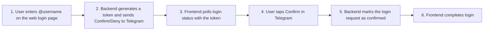

# Security

## Threat Model

The Habit Reward system uses Telegram-based authentication (Confirm/Deny buttons) instead of passwords. The primary threat model covers:

1. **Username enumeration** — An attacker probing the login endpoint to discover valid usernames.
2. **Timing side-channels** — Measuring response times to distinguish valid from invalid usernames or different internal states.
3. **Token brute-force** — Guessing login tokens to hijack a session.
4. **Token replay** — Reusing a consumed token to create a duplicate session.
5. **Rate-limit bypass** — Circumventing per-IP rate limits via IP spoofing (X-Forwarded-For).
6. **Cross-site attacks** — CSRF, XSS, and injection via user-controlled inputs (username, User-Agent).

### OWASP Top 10 Coverage

The following OWASP Top 10 (2021) vulnerabilities are explicitly mitigated:

| OWASP ID | Vulnerability | Mitigation |
|---|---|---|
| **A01:2021** | Broken Access Control | IP binding on login tokens, atomic `SELECT FOR UPDATE` preventing replay, per-IP rate limiting on all auth endpoints. |
| **A03:2021** | Injection | User-Agent sanitization (non-printable chars stripped), Telegram messages sent as plain text (no parse_mode), Django ORM parameterized queries, DB-level `CHECK` constraint on `telegram_username`. |
| **A07:2021** | Identification and Authentication Failures | Anti-enumeration (identical responses for known/unknown users), 256-bit token entropy, timing jitter (50-200ms CSPRNG), rate limiting, single-use tokens with atomic mark-as-used. |

## Security Properties

### Anti-Enumeration

Both known and unknown usernames receive an identical HTTP 200 response with a token and generic message. All DB writes and Telegram API calls are deferred to a background thread pool, so response timing is constant regardless of user existence. An attacker cannot distinguish valid from invalid usernames by observing:

- Response body (same structure for both)
- Response status code (always 200)
- Response timing (constant-time synchronous path)
- Status polling behavior (cache-only tokens for unknown users expire silently via TTL)

### Timing Attack Resistance

- **Status polling jitter**: `check_status` adds 50-200ms random jitter (configurable via `WEB_LOGIN_JITTER_MIN`/`WEB_LOGIN_JITTER_MAX`) from a `secrets.SystemRandom()` CSPRNG.
- **Jitter scope**: Applied to **all** statuses (`pending`, `expired`, `error`, `confirmed`, `denied`, `used`). Cache-hit paths can be measurably faster than DB fallback, so universal jitter helps prevent statistical timing analysis across status paths.
- **Background processing**: Token generation, cache writes, and HTTP response happen synchronously. DB writes and Telegram sends happen asynchronously in a bounded thread pool.

### Login Flow

### Token Security

- **256-bit entropy**: Login tokens use `secrets.token_urlsafe(32)` (256 bits), making brute-force infeasible.
- **Format validation**: Tokens are validated for length (40-50 chars) and character set (URL-safe base64) before processing.
- **Atomic replay prevention**: Confirmed tokens are atomically marked `used` via `UPDATE ... WHERE status='confirmed'`, preventing race conditions.
- **Single-use guarantee**: `mark_as_used` returns the count of updated rows — if 0, the token was already consumed.

### Rate Limiting

All authentication endpoints are rate-limited per IP via `django-ratelimit`:

| Endpoint | Setting | Default |
|---|---|---|
| `POST /auth/bot-login/request/` | `AUTH_RATE_LIMIT` | `10/m` |
| `GET /auth/bot-login/status/<token>/` | `AUTH_STATUS_RATE_LIMIT` | `30/m` |
| `POST /auth/bot-login/complete/` | `AUTH_RATE_LIMIT` | `10/m` |

### X-Forwarded-For Trust

`TRUST_X_FORWARDED_FOR` must only be enabled behind a trusted reverse proxy that overwrites the header. Without a proxy, clients can spoof their IP to bypass rate limiting. Django system checks (`web.E001`, `web.E002`) **error** (fail startup) when this is misconfigured.

### Input Validation

- **Username**: Validated against `^[a-z0-9_]{3,32}$` (lowercase only — input is lowercased before validation on both frontend and backend). A pre-commit hook verifies both patterns stay in sync.
- **User-Agent**: Truncated to 512 chars (typical UAs are 100-300 chars), filtered for non-printable characters, parsed via `user-agents` library (never used as raw HTML). Oversized UAs are logged at WARNING before truncation.
- **Telegram messages**: Sent with `parse_mode=None` (plain text) as defense-in-depth against injection.
- **DB constraints**: `telegram_username` has a database-level `CHECK` constraint ensuring format validity.

### GDPR

- **IP anonymization**: IP addresses are hashed via SHA-256 (16-hex-char prefix) before logging. Raw IPs are never stored.
- **No IP in device_info**: The device description sent to Telegram excludes IP addresses entirely.
- **Minimal data**: Only `telegram_id` is stored for user identification.

### Cache Security

- **Namespace isolation**: Login cache keys use dedicated `wl_pending:`, `wl_failed:`, and `wl_alias:` prefixes to avoid collisions with unrelated application entries.
- **Minimized cache payloads**: Normal status keys store only boolean flags. A rare token-collision retry writes a short-lived alias value (`old_token -> new_token`) so clients with the originally issued token can still resolve status safely. No user IDs or session data are stored in cache values.
- **TTL enforcement**: All cache entries use a TTL derived from the login request's `expires_at` (max 5 minutes), limiting the window for cache poisoning attacks. Stale entries are automatically evicted.

## IP Binding Protection

Login tokens are bound to the originating client's IP address to prevent cross-IP token theft via CSRF, XSS, or network sniffing.

### How it works

When a user initiates a login request (`POST /auth/bot-login/request/`), the server creates a `LoginTokenIpBinding` record in the database tying the returned token to the client's IP address. All subsequent interactions with that token — status polling (`GET /auth/bot-login/status/<token>/`) and login completion (`POST /auth/bot-login/complete/`) — verify that the caller's IP matches the stored binding. Mismatched IPs receive a generic "expired" or 403 response.

### What it protects against

- **Cross-IP token reuse**: An attacker who steals a token (via XSS, CSRF, or network interception) cannot use it from a different IP address.
- **Session fixation via IP spoofing**: Since bindings are stored in the database (not in Django sessions), they are immune to session fixation, cookie exposure, and XSS attacks against session cookies.
- **Race conditions**: The IP binding is persisted to the database **before** the token is returned to the client, preventing a window where an attacker could poll the token before the binding exists.

### What it does NOT protect against

- **Same-IP MITM**: An attacker on the same network (shared IP via NAT) can still intercept and reuse tokens. HTTPS enforcement is required to mitigate this.
- **Session fixation at the Django session level**: The IP binding only protects the login token flow, not the post-login Django session.
- **IP spoofing behind misconfigured proxies**: If `TRUST_X_FORWARDED_FOR` is enabled without a trusted reverse proxy, attackers can spoof their IP via the `X-Forwarded-For` header.

### Recommendations

- **Always enforce HTTPS** in production to prevent token interception.
- Only enable `TRUST_X_FORWARDED_FOR` behind a trusted reverse proxy that overwrites the header.
- Expired `LoginTokenIpBinding` records are cleaned up via the same housekeeping process as expired `WebLoginRequest` records.

## Circuit Breakers

- **Thread pool queue**: When `WEB_LOGIN_MAX_QUEUED` is exceeded, new requests return HTTP 503 (prevents unbounded resource consumption).
- **Cache failure threshold**: After 5 consecutive cache write failures, `CacheWriteError` is raised and the login request returns 503 (surfaces cache misconfiguration instead of silently degrading).

## Reporting Vulnerabilities

If you discover a security vulnerability, please report it responsibly by opening a private issue or contacting the maintainers directly. Do not disclose vulnerabilities publicly until a fix is available.
